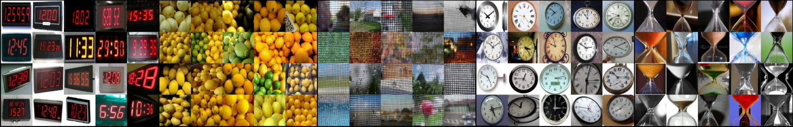

# OmnImage 

The [OmniImage](https://www.uvm.edu/~lfrati/omnimage.html) dataset contains a 1000 classes with 20|100 [images](https://drive.google.com/file/d/1rR7Xh4sxXVY9im_DrjZwEf2oydmx8YWL/view) each, downsized to 84x84 pixels.

# Download
- We provide images resized to 84x84 at https://www.uvm.edu/~lfrati/omnimage.html
- If you'd rather use different resolution we provide a list of the images used [here for 20 samples](OmnImage_20.txt) and [here for 100 samples](OmnImage_100.txt)
- We provide some PyTorch Dataloaders [here](omnimage.py) (that also download the data) and examples on how to use them [here](tests/test_omnimage.py)

# Why?

- [MNIST](https://en.wikipedia.org/wiki/MNIST_database) has 10 classes and thousands of examples for each class.
- [ImageNet](https://www.image-net.org/) has 1000 classes with thousands of example each.
- [Omniglot](https://github.com/brendenlake/omniglot) has 1623 classes with tens of examples each.

<p align="center">
  
</p>

However, while ImageNet contains natural images MNIST and Omniglot only contain examples of handwritten digits/characters.

[OmniImage](https://www.uvm.edu/~lfrati/omnimage.html) is a class-consistent subset of [ImageNet](https://www.image-net.org/) images that mirrors the shallow-and-wide dataset shape of [Omniglot](https://github.com/brendenlake/omniglot).

# How?
While characters are fairly easy to "characterize" (barring some bad handwriting) natural images can vary wildly. We try to reduce the noise in our dataset by extracting the 20|100 subset of each class that is most similar to each other.
We do this by using [evolutionary pairwise cosines subset minimization](https://github.com/lfrati/subpair). For each of the 1000 classes we compute the pairwise cosine distance between all the the examples (features extracted using a pretrained VGG model). We then evolve the minimal subset for each class and add those examples to our dataset.

# Cite
```bibtex
@inproceedings{frati2023omnimage,
  title={OmnImage: Evolving 1k Image Cliques for Few-Shot Learning},
  author={Frati, Lapo and Traft, Neil and Cheney, Nick},
  booktitle={Proceedings of the Genetic and Evolutionary Computation Conference},
  pages={476--484},
  year={2023}
}
```
